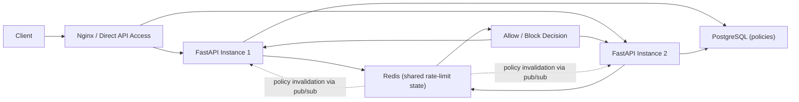

# Distributed Rate Limiter

A scalable, Redis-backed rate limiting system for APIs, built with FastAPI, PostgreSQL, and Docker.

## 1. Problem Statement

Rate limiting protects APIs from abuse and keeps systems stable under load.

It helps with:

- preventing spam or brute-force style traffic
- protecting backend services from overload
- keeping access fair across users, IPs, and routes
- smoothing bursts instead of letting one client consume all capacity

In a distributed system, rate limiting is harder because multiple API instances may handle requests for the same client at the same time. If each instance keeps its own counters, limits can be bypassed. This project solves that by keeping shared rate-limit state in Redis and making decisions atomically.

## 2. Key Features

- Supports three algorithms:
  - token bucket
  - fixed window
  - sliding window log
- Token bucket is the default policy choice for production-style endpoints
- Supports limits by:
  - user ID
  - IP address
  - route
  - composite selectors like `user_id + route`
- Stores rate-limit policies in PostgreSQL
- Caches active policies in Redis
- Uses Redis Lua scripts for atomic, concurrency-safe updates
- Returns `429 Too Many Requests` when blocked
- Returns standard headers:
  - `X-RateLimit-Limit`
  - `X-RateLimit-Remaining`
  - `X-RateLimit-Reset`
  - `Retry-After`
- Supports fail-open and fail-closed behavior when Redis is unavailable
- Exposes admin APIs for policy CRUD
- Includes Prometheus metrics, structured logs, Docker setup, and tests

## 3. System Architecture



### What this means

- API servers are stateless with respect to rate-limit counters.
- PostgreSQL stores the source-of-truth policies.
- Redis stores shared counters and token state.
- Every API instance checks the same Redis state, so limits still work correctly when traffic is spread across multiple containers or servers.

## 4. How It Works

For each incoming request:

1. The API extracts request identity:
   - route template
   - user ID from path or header
   - client IP
2. The policy service loads the best matching active policy.
   - It first checks Redis cache.
   - On a miss, it loads from PostgreSQL and refreshes the cache.
3. The limiter generates a deterministic Redis key based on:
   - policy ID
   - policy version
   - matching selectors such as route, user, or IP
4. A Redis Lua script runs the selected algorithm atomically.
5. The request is either:
   - allowed, with rate-limit headers
   - blocked with `429`, plus retry information

If Redis is temporarily unavailable:

- fail-open policies allow traffic
- fail-closed policies reject traffic

## 5. Algorithms Explained

### Token Bucket

Think of this as a bucket of tokens that refills over time.

- Each request consumes one token.
- If tokens are available, the request is allowed.
- If the bucket is empty, the request is blocked.

Why it is useful:

- allows short bursts
- still enforces a steady refill rate
- feels natural for production APIs

### Fixed Window

Requests are counted inside a fixed time window, such as 10 requests per minute.

- easy to implement
- cheap to store
- can allow burstiness at window boundaries

### Sliding Window Log

Each request timestamp is recorded and old entries are removed continuously.

- more accurate than fixed windows
- prevents boundary spikes
- costs more memory and Redis work

### Interview takeaway

- use fixed window when simplicity matters
- use sliding window when fairness matters
- use token bucket when you want controlled bursts plus good production behavior

## 6. Tech Stack

- Python
- FastAPI
- Redis
- PostgreSQL
- SQLAlchemy
- Alembic
- Docker + Docker Compose
- pytest
- Prometheus
- Optional Nginx reverse proxy
- Locust load test profile

## 7. Getting Started

### Clone the repository

```bash
git clone https://github.com/Nava-deep/DistributedRateLimiter.git
cd DistributedRateLimiter
```

### Set up local development

```bash
python3 -m venv .venv
source .venv/bin/activate
pip install -e '.[dev]'
cp .env.example .env
```

### Start dependencies

```bash
docker compose up -d postgres redis
```

### Run database migrations

```bash
alembic upgrade head
```

### Seed demo policies

```bash
python scripts/seed_demo_policies.py
```

### Start the API

```bash
uvicorn app.main:app --reload --host 0.0.0.0 --port 8000
```

### Run tests

```bash
pytest -q
```

### Start the distributed demo with multiple API instances

```bash
docker compose up -d postgres redis
docker compose run --rm migrate
docker compose up --build api1 api2 nginx prometheus
```

Access points:

- Nginx entrypoint: `http://localhost:8000`
- API instance 1: `http://localhost:8001`
- API instance 2: `http://localhost:8002`
- Prometheus: `http://localhost:9090`

## 8. Example Usage

### Create a policy

```bash
curl -X POST http://localhost:8000/admin/policies \
  -H 'Content-Type: application/json' \
  -H 'X-Admin-Token: super-secret-admin-token' \
  -d '{
    "name": "protected-default",
    "algorithm": "token_bucket",
    "rate": 10,
    "window_seconds": 60,
    "burst_capacity": 15,
    "route": "/demo/protected",
    "failure_mode": "fail_closed"
  }'
```

### Call a protected endpoint

```bash
curl -i http://localhost:8000/demo/protected
```

Example successful response headers:

```http
X-RateLimit-Limit: 15
X-RateLimit-Remaining: 14
X-RateLimit-Reset: 1712345678
Retry-After: 0
```

Example blocked response:

```http
HTTP/1.1 429 Too Many Requests
X-RateLimit-Limit: 15
X-RateLimit-Remaining: 0
X-RateLimit-Reset: 1712345678
Retry-After: 12
```

### Call a user-scoped endpoint

```bash
curl -i http://localhost:8000/demo/user/vip-user
```

### Useful endpoints

- `POST /admin/policies`
- `GET /admin/policies`
- `GET /admin/policies/{id}`
- `PUT /admin/policies/{id}`
- `DELETE /admin/policies/{id}`
- `GET /health`
- `GET /metrics`
- `GET /demo/public`
- `GET /demo/protected`
- `GET /demo/user/{user_id}`

### Header explanation

- `X-RateLimit-Limit`: total allowed capacity for the current policy
- `X-RateLimit-Remaining`: how many requests are left
- `X-RateLimit-Reset`: when the bucket or window resets
- `Retry-After`: how long to wait before retrying

## 9. Concurrency & Distributed Safety

This is the most important part of the project.

The main challenge in distributed rate limiting is race conditions:

- two API instances can receive requests for the same client at the same time
- naive `GET` then `SET` logic can allow both requests through
- local in-memory counters break as soon as traffic is spread across instances

This project avoids that by using Redis Lua scripts.

Each algorithm runs as a single atomic operation inside Redis:

- fixed window: increment + expiry
- sliding window log: evict old entries + count + add new request
- token bucket: refill + consume token + persist updated state

Why this works:

- Redis executes a Lua script atomically
- all API instances share the same Redis keys
- policy version is part of the key, so updated policies do not reuse old counters
- integration tests verify that simultaneous requests cannot bypass a limit

## 10. Scaling

The system is designed to scale horizontally.

- API servers are stateless
- rate-limit state is shared in Redis
- policy definitions are shared through PostgreSQL
- multiple FastAPI instances can sit behind a load balancer and still enforce the same limits

This means you can increase API instances without breaking correctness, as long as they point to the same Redis and PostgreSQL backends.

## 11. Design Decisions

### Why Redis?

Redis is a strong fit for distributed rate limiting because it offers:

- low latency
- shared centralized state
- built-in atomic execution with Lua
- data structures that fit counters, hashes, and sorted sets

### Why PostgreSQL?

Policies need durable storage and CRUD support. PostgreSQL is used as the source of truth for admin-managed policies.

### Why token bucket as the default?

Token bucket gives the best balance for API traffic:

- supports bursts
- still controls sustained traffic
- behaves more naturally than hard fixed windows

### Why cache policies in Redis too?

Because the limiter needs fast policy lookups. PostgreSQL remains the source of truth, but Redis reduces lookup overhead and pub/sub helps invalidate stale policy caches.

## 12. Future Improvements

- multi-region rate limiting
- edge or gateway-based enforcement
- dynamic policy updates without admin API calls
- Redis Cluster support
- richer dashboards for policy usage
- wildcard route matching and more advanced policy hierarchy

## 13. Resume Highlights

- Built a distributed rate limiter with FastAPI, Redis, and PostgreSQL that enforced per-user, per-IP, per-route, and composite policies across horizontally scaled API instances.
- Implemented token bucket, fixed window, and sliding window log algorithms using Redis Lua scripts to guarantee concurrency-safe rate-limit decisions under simultaneous requests.
- Designed policy CRUD, Redis caching, degraded fail-open/fail-closed behavior, Prometheus metrics, Dockerized deployment, and automated tests for a production-style backend systems project.
