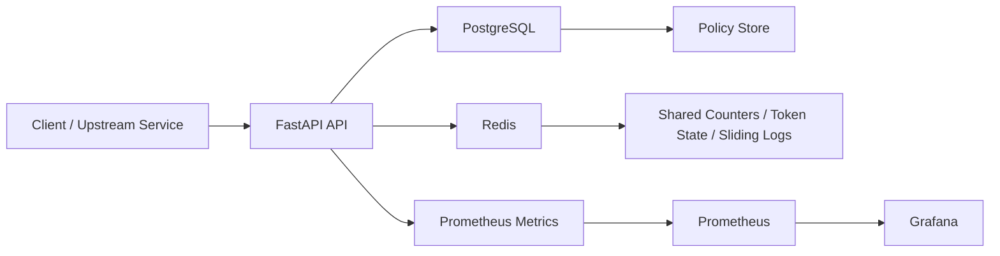

# Distributed Rate Limiter

Distributed Rate Limiter is a FastAPI service for enforcing shared quotas across horizontally scaled application instances. It is designed for environments where multiple API servers must make the same allow/block decision under concurrency without drifting apart.

The service uses Redis for atomic coordination, PostgreSQL for policy storage, and Prometheus metrics for operational visibility.

## What It Does

This service provides:

- distributed per-user, per-IP, per-route, and composite quotas
- atomic decision-making across multiple stateless API instances
- centralized policy management
- deterministic Redis keys for shared state
- fail-open, fail-closed, and local fallback behavior
- service-to-service decision APIs for internal platform integrations

## Platform Role

Distributed Rate Limiter is one of the three connected services in the platform:

- `Judge Vortex`: main exam and judging application
- `Config Control Plane`: source of runtime policy configuration
- `DistributedRateLimiter`: shared quota and submission guard service

In the deployed platform:

- Judge Vortex can call `/internal/evaluate` to decide whether a submission request should be allowed
- DistributedRateLimiter can pull `judge-vortex.submission-rate-limit-policy` from Config Control Plane
- submission control can be updated without changing Judge Vortex application code

## Why This Service Exists

Simple in-memory throttling breaks down once traffic is distributed across multiple app instances.

In a multi-instance deployment:

- the same client can hit different servers on consecutive requests
- local counters diverge
- concurrent requests can overrun the limit if state updates are not atomic

This project solves that by moving the rate-limit state transition into Redis and executing it atomically.

## Supported Algorithms

### Token Bucket

- supports burst traffic
- limits sustained throughput
- production-oriented default for API traffic

### Fixed Window

- simple discrete window counting
- lower implementation cost
- less fair near window boundaries

### Sliding Window Log

- records recent request timestamps
- more accurate than fixed window
- higher state and operation cost

## Architecture

## Core Capabilities

- policy CRUD and policy precedence handling
- route-aware and identity-aware matching
- Redis Lua based atomic decision execution
- policy caching with invalidation behavior
- retry handling for transient Redis failures
- optional local in-memory fallback limiter
- internal decision endpoints for trusted platform consumers

## Internal Platform Endpoints

- `POST /internal/evaluate`
  trusted internal decision endpoint for service-to-service submission checks

- `POST /internal/sync/config-control`
  pulls the latest Judge Vortex limiter policy from Config Control Plane and upserts it into the service policy store

These internal routes are protected separately from public admin APIs.

## AWS Deployment

This service is deployed as a private platform component in the AWS-hosted stack.

- it sits behind the main application layer rather than acting as the primary public entrypoint
- it shares platform observability with Judge Vortex and Config Control Plane
- its metrics are exposed through the same monitoring surface used by the rest of the platform

## Observability

The service exposes operational signals for:

- allowed vs blocked request counts
- decision latency
- cache behavior
- fallback activation
- Redis health and coordination behavior
- policy sync activity for Judge Vortex integration

## Repository Structure

- `app/`: API routes, algorithms, services, config, and security
- `alembic/`: database migrations
- `monitoring/`: metrics and dashboard support
- `docker-compose.yml`: service wiring for the platform stack

## Summary

Distributed Rate Limiter is a backend coordination service built to make correct quota decisions under concurrent, multi-instance traffic. Inside this platform, it serves as the shared submission guard for Judge Vortex and the execution-time policy consumer for Config Control Plane.
