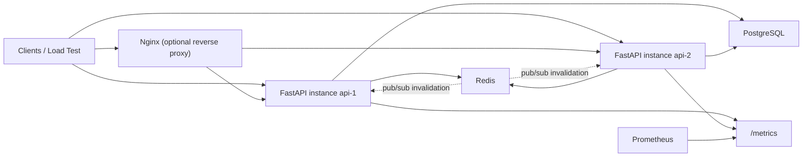

# distributed-rate-limiter

`distributed-rate-limiter` is a production-style FastAPI service that enforces distributed rate limits across horizontally scaled API instances using Redis for shared state and PostgreSQL for policy storage. The project is built to showcase concurrency-safe backend engineering, operational readiness, and clean API design for internship interviews at companies that care about systems thinking.

## Why this project stands out

- Distributed correctness is enforced with Redis Lua scripts, so concurrent requests across multiple API instances cannot bypass limits.
- Policies are managed through admin APIs, persisted in PostgreSQL, cached in Redis, and invalidated through Redis pub/sub.
- The service includes structured logging, Prometheus metrics, degraded-mode behavior, migrations, Dockerized local infrastructure, load testing, and an end-to-end automated test suite.

## Core features

- Fixed window, sliding window log, and token bucket algorithms.
- Per-user, per-IP, per-route, and composite selectors such as `user_id + route`.
- PostgreSQL-backed policy CRUD with Redis hot-cache and local fallback snapshot.
- Standard rate limit headers: `X-RateLimit-Limit`, `X-RateLimit-Remaining`, `X-RateLimit-Reset`, and `Retry-After`.
- Configurable fail-open and fail-closed behavior when Redis is unavailable.
- Prometheus metrics and JSON structured logs for operational visibility.
- Docker Compose setup for Redis, PostgreSQL, two API instances, Nginx, and Prometheus.

## Architecture



## Request flow

1. FastAPI extracts request identity from the route template, `user_id`, client IP, tenant header, and API key header.
2. The policy service resolves the best matching policy from the Redis-cached active policy snapshot, falling back to PostgreSQL if needed.
3. The rate limiter builds a deterministic Redis key and executes a Lua script atomically for the selected algorithm.
4. The service returns headers for remaining quota and reset timing, or a `429 Too Many Requests` if blocked.
5. Prometheus metrics and structured JSON logs record the allow/block decision.

## Concurrency safety and race-condition prevention

The core distributed guarantee comes from doing each admission decision inside Redis with Lua:

- Fixed window uses `INCR` and `PEXPIRE` in one atomic script.
- Sliding window log removes expired entries, counts the active set, and conditionally adds the new request in one atomic script.
- Token bucket refills tokens, decrements tokens, updates timestamps, and computes retry timing in one atomic script.

Why this is safe:

- Redis executes a Lua script atomically with respect to other commands.
- All API instances share the same Redis keys for a policy/version/selector combination.
- Policy versions are embedded in rate-limit keys, so policy changes do not reuse stale counters from old configurations.
- The integration test `test_concurrent_requests_do_not_bypass_limit` sends 20 simultaneous requests against a limit of 10 and verifies exactly 10 requests are allowed and 10 are blocked.

## Algorithms and tradeoffs

| Algorithm | Strengths | Tradeoffs | Best use |
|---|---|---|---|
| Fixed window | Simple, low memory, cheap Redis operations | Boundary spikes at window edges | Coarse admin or low-sensitivity limits |
| Sliding window log | Precise request history, no boundary burst | Higher Redis memory and sorted-set cost | Fairness-sensitive endpoints |
| Token bucket | Smooth refill, supports burst capacity, production friendly | Slightly more math and state | Default for real production endpoints |

This project defaults to token bucket because it provides better real-world behavior for bursty traffic while still protecting steady-state throughput.

## Degraded mode behavior

If Redis becomes temporarily unavailable:

- Fail-open policies allow traffic and return best-effort headers.
- Fail-closed policies reject traffic with `429` to preserve protection on critical routes.
- Active policy snapshots are still available from PostgreSQL and an in-process fallback cache.

This makes the reliability tradeoff explicit instead of silently changing security posture.

## Project structure

```text
app/
  api/
  core/
  db/
  middleware/
  models/
  redis/
  schemas/
  services/
alembic/
  versions/
loadtests/
nginx/
prometheus/
scripts/
tests/
```

## API surface

- `POST /admin/policies`
- `GET /admin/policies`
- `GET /admin/policies/{id}`
- `PUT /admin/policies/{id}`
- `DELETE /admin/policies/{id}`
- `GET /health`
- `GET /metrics`
- `GET /demo/public`
- `GET /demo/protected`
- `GET /demo/user/{user_id}`

Admin endpoints require `X-Admin-Token`.

## Example policies

```json
{
  "name": "protected-default",
  "algorithm": "token_bucket",
  "rate": 10,
  "window_seconds": 60,
  "burst_capacity": 15,
  "route": "/demo/protected",
  "failure_mode": "fail_closed"
}
```

```json
{
  "name": "vip-user-override",
  "algorithm": "sliding_window_log",
  "rate": 30,
  "window_seconds": 60,
  "route": "/demo/user/{user_id}",
  "user_id": "vip-user",
  "failure_mode": "fail_closed"
}
```

```json
{
  "name": "public-route-open",
  "algorithm": "token_bucket",
  "rate": 30,
  "window_seconds": 60,
  "burst_capacity": 60,
  "route": "/demo/public",
  "failure_mode": "fail_open"
}
```

## Local setup

### 1. Create a virtual environment

```bash
python3 -m venv .venv
source .venv/bin/activate
pip install -e '.[dev]'
cp .env.example .env
```

### 2. Start PostgreSQL and Redis locally

```bash
docker compose up -d postgres redis
```

### 3. Run migrations

```bash
alembic upgrade head
```

### 4. Optionally seed demo policies

```bash
python scripts/seed_demo_policies.py
```

### 5. Start the API

```bash
uvicorn app.main:app --reload --host 0.0.0.0 --port 8000
```

Or with `make`:

```bash
make install
make migrate
make seed-demo
make run
```

## Docker Compose workflow

Start infrastructure and apply schema:

```bash
cp .env.example .env
docker compose up -d postgres redis
docker compose run --rm migrate
```

Start two API instances, Nginx, and Prometheus:

```bash
docker compose up --build api1 api2 nginx prometheus
```

Endpoints:

- API instance 1: `http://localhost:8001`
- API instance 2: `http://localhost:8002`
- Nginx load-balanced entrypoint: `http://localhost:8000`
- Prometheus: `http://localhost:9090`

## Running multiple instances against one Redis

This is the core distributed demo:

```bash
docker compose up -d postgres redis
docker compose run --rm migrate
docker compose up --build api1 api2 nginx
```

Then drive traffic through Nginx:

```bash
curl http://localhost:8000/demo/protected
```

Both API containers share Redis, so they consume the same quota.

## Sample curl commands

Create a policy:

```bash
curl -X POST http://localhost:8000/admin/policies \
  -H 'Content-Type: application/json' \
  -H 'X-Admin-Token: super-secret-admin-token' \
  -d '{
    "name": "protected-default",
    "algorithm": "token_bucket",
    "rate": 10,
    "window_seconds": 60,
    "burst_capacity": 15,
    "route": "/demo/protected",
    "failure_mode": "fail_closed"
  }'
```

List active policies:

```bash
curl -H 'X-Admin-Token: super-secret-admin-token' \
  http://localhost:8000/admin/policies
```

Exercise a protected endpoint:

```bash
curl -i http://localhost:8000/demo/protected
```

Exercise a user-specific route:

```bash
curl -i http://localhost:8000/demo/user/vip-user
```

## Observability

Prometheus metrics exposed at `/metrics`:

- `distributed_rate_limiter_http_requests_total`
- `distributed_rate_limiter_allowed_requests_total`
- `distributed_rate_limiter_blocked_requests_total`
- `distributed_rate_limiter_request_latency_seconds`
- `distributed_rate_limiter_policy_cache_hits_total`
- `distributed_rate_limiter_policy_cache_misses_total`
- `distributed_rate_limiter_redis_errors_total`

Structured JSON logs include:

- `allow`
- `block`
- `policy_load`
- `policy_cache_invalidated`
- `policy_refresh_received`
- `redis_fallback`

## Testing

Run the full suite:

```bash
pytest -q
```

Run only unit tests:

```bash
pytest -q -m unit
```

Run only integration tests:

```bash
pytest -q -m integration
```

The repository currently includes 29 meaningful tests:

- 16 unit tests for algorithm math, key generation, and policy matching
- 13 integration tests for admin CRUD, Redis-backed limiting, degraded behavior, and concurrent request correctness

## Load testing

A Locust profile is included at [`loadtests/locustfile.py`](loadtests/locustfile.py).

Example run:

```bash
locust -f loadtests/locustfile.py --host http://localhost:8000
```

Recommended demo flow:

1. Start `api1`, `api2`, `nginx`, `postgres`, and `redis`.
2. Seed demo policies.
3. Run Locust with 100-500 users depending on your laptop.
4. Watch `/metrics` and Prometheus while traffic hits both instances.

## Expected throughput and bottlenecks

Expected behavior on a local laptop:

- Token bucket and fixed window paths are typically limited more by network round-trip to Redis than CPU in FastAPI.
- Sliding window log is heavier because each request touches a sorted set and incurs more Redis memory churn.
- Policy cache misses are more expensive because they hit PostgreSQL and repopulate Redis.

Primary bottlenecks:

- Redis latency and single-threaded script execution under very high QPS
- Sorted-set memory growth for sliding window log
- PostgreSQL load if policy cache TTL is too short or invalidation churn is high
- Python app worker count if request volume outgrows one Uvicorn process per container

## Scaling explanation

Horizontal scaling works because API instances are stateless with respect to rate-limit counters:

- Policy definitions live in PostgreSQL.
- Active policies are cached in Redis and also mirrored in a short-lived in-process snapshot.
- Rate-limit state lives entirely in Redis with deterministic keys.
- Any number of FastAPI replicas can enforce the same policy as long as they share Redis and PostgreSQL.

For higher scale, the next steps would be Redis clustering, separate read replicas for policy queries, and Uvicorn/Gunicorn worker tuning per host.

## Interview talking points

- Why token bucket is a better production default than fixed window for bursty APIs.
- Why Redis Lua scripts are safer than naive `GET`/`SET` sequences under concurrency.
- How policy versioning avoids stale counters after policy updates.
- How fail-open vs fail-closed changes system safety and user experience.
- Why policy cache invalidation uses Redis pub/sub instead of waiting for TTL expiration everywhere.
- How you would shard rate-limit keys or add Redis Cluster support at larger scale.

## Future improvements

- Redis Cluster-aware sharding and multi-region replication strategy
- Circuit breaker around Redis with rolling error budgets
- Tenant-aware dashboards and policy analytics UI
- API key auth and per-tenant quota management
- Grafana dashboards and alert rules
- More advanced route wildcards and hierarchical policy matching
- GitHub Actions matrix for unit versus integration test jobs

## Resume-ready angles

- Built a distributed rate limiter with FastAPI, Redis, and PostgreSQL that enforces per-user, per-IP, per-route, and composite policies across horizontally scaled API instances.
- Implemented concurrency-safe fixed window, sliding window log, and token bucket algorithms using Redis Lua scripts, with degraded fail-open/fail-closed behavior and Prometheus instrumentation.
- Designed policy CRUD, caching, invalidation, testing, Dockerized local infrastructure, and operational documentation to mirror production backend service standards.
