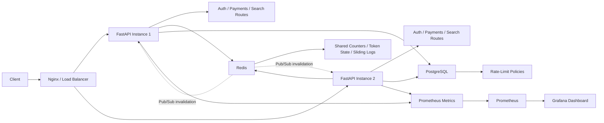

# Distributed Rate Limiter

A distributed rate limiting service built with FastAPI, Redis, PostgreSQL, and Docker that enforces one shared quota across multiple API instances using atomic Redis coordination, explicit failover behavior, and platform-style service integration.

## What This Project Is

This project is a backend systems project focused on a real distributed-systems problem: how to enforce API rate limits correctly when traffic is spread across multiple stateless application servers.

The service supports:

- per-user limits
- per-IP limits
- per-route limits
- composite limits such as `user_id + route`
- multiple rate limiting algorithms
- centralized policy management
- shared distributed state
- degraded behavior when Redis is unavailable
- local in-memory failover when Redis is unavailable
- platform-style service routes for auth, payments, and search
- India and US multi-region consistency simulation
- observability and reproducible synthetic benchmarking

The goal of the project is not only to block extra requests. The real goal is to do that correctly under concurrency, horizontal scaling, and dependency failures.

## Judge Vortex Integration

This service can now act as the shared submission guard for Judge Vortex.

- `POST /internal/evaluate` accepts a trusted service-to-service identity payload and returns an allow or block decision without proxying the protected request
- `POST /internal/sync/config-control` pulls the Judge Vortex submission policy from Config Control Plane and upserts it into the local policy store
- `SERVICE_TOKEN` protects the internal API separately from the admin API token

The default Config Control Plane config name for this path is `judge-vortex.submission-rate-limit-policy`.

## Why Rate Limiting Is Hard In Distributed Systems

Rate limiting is easy to describe and easy to get wrong.

In a single process, an application can keep counters in memory and reject traffic once a threshold is reached. That approach stops working in a distributed deployment.

When there are multiple API instances:

- the same user can hit different instances on consecutive requests
- each instance sees only part of the traffic
- local counters drift apart
- concurrent requests can read the same state at the same time
- naive read-then-write code can allow more requests than the configured limit

That is why this project uses Redis as shared coordination infrastructure. Every instance reads and updates the same distributed state, and the critical rate-limit operation is executed atomically inside Redis.

## What The Service Does

This service exposes three groups of APIs:

- admin APIs for creating, updating, listing, and deleting rate-limit policies
- demo APIs that are protected by the distributed rate limiter
- dummy platform service APIs for auth, payments, and search

Policies are stored in PostgreSQL and cached in Redis. When a request arrives, the service resolves the best matching policy, derives a deterministic Redis key, executes the selected algorithm atomically, and returns either:

- `200` with rate-limit headers if the request is allowed
- `429 Too Many Requests` with retry metadata if the request is blocked

If Redis is unavailable, the service can:

- retry the Redis operation for transient failures
- switch to a local in-memory limiter on the current instance
- fall back to fail-open or fail-closed behavior when local failover is disabled

## Implemented Algorithms

### Token Bucket

Token bucket is the default production-oriented algorithm in this project.

How it works:

- each client or route has a bucket with a fixed capacity
- tokens refill over time at a configured rate
- each request consumes one token
- if a token is available, the request is allowed
- if no token is available, the request is blocked

Why it is useful:

- supports burst traffic naturally
- still limits sustained request rate
- maps well to real API traffic patterns

### Fixed Window

Fixed window counts requests inside a time bucket such as one minute.

How it works:

- requests are counted in a single discrete window
- once the counter reaches the configured limit, later requests in that window are blocked
- the counter resets at the next window boundary

Tradeoff:

- simple and cheap
- can be unfair near window edges

### Sliding Window Log

Sliding window log stores recent request timestamps and continuously drops old entries.

How it works:

- each request timestamp is recorded
- timestamps outside the active window are removed
- the number of remaining timestamps determines whether the next request is allowed

Tradeoff:

- more accurate and fair than fixed window
- more expensive in memory and Redis operations

## Architecture



### Component Roles

#### FastAPI

FastAPI handles HTTP traffic, exposes admin endpoints, applies rate limiting to protected routes, and returns standard rate-limit headers.

#### PostgreSQL

PostgreSQL is the source of truth for policy definitions. Policies can be created, updated, listed, and deleted through admin APIs.

#### Redis

Redis has two roles:

- shared rate-limit state for counters, token buckets, and sliding-window logs
- hot cache for active policies

Redis is also used for pub/sub invalidation so that all API instances can refresh local policy snapshots when policy definitions change.

#### Platform Service Routes

The project also includes three dummy service routes:

- auth
- payments
- search

They reuse the same rate-limiter dependency to show how the limiter can protect multiple platform services without changing the core coordination logic.

#### Nginx

Nginx is included as an optional reverse proxy to demonstrate how multiple API instances can sit behind one entrypoint while still enforcing a single shared quota.

#### Prometheus And Grafana

Prometheus scrapes `/metrics` from both API instances. Grafana is pre-provisioned with a dashboard for traffic, allow/block decisions, latency, cache behavior, retries, and local failover activity.

## How A Request Flows Through The System

When a request hits a protected endpoint, the service follows this flow:

1. Build request identity

The service extracts the request attributes that matter for policy matching, such as:

- route template
- `user_id`
- client IP
- tenant ID
- API key

2. Resolve the best matching policy

The policy service tries Redis cache first. If the policy cache is missing, it loads active policies from PostgreSQL and refreshes the cache. Policy matching supports scope precedence, so a specific rule such as `user_id + route` can override a general route-level rule.

3. Build a deterministic Redis key

The key includes the algorithm, policy ID, policy version, and the active selectors for that request. This ensures:

- all API instances update the same shared key for the same quota
- policy updates do not accidentally reuse old counters

4. Execute the algorithm atomically

The service uses Redis Lua scripts to apply the selected algorithm as one atomic operation. This prevents race conditions between parallel requests.

5. Return the decision

If the request is allowed, the service returns the resource along with:

- `X-RateLimit-Limit`
- `X-RateLimit-Remaining`
- `X-RateLimit-Reset`
- `Retry-After`

If the request is blocked, it returns `429 Too Many Requests` with the same header set.

## Why The Implementation Is Concurrency-Safe

The central correctness problem is this:

Two API instances can receive the same user’s request at almost the same time. If both instances read the current counter first and then both increment it separately, both requests may pass even when only one should.

This project prevents that with Redis atomic execution.

Instead of doing:

- read current value
- compute next value in application code
- write updated value back

the service executes the full state transition inside Redis with Lua.

That matters because Redis guarantees that a Lua script runs atomically. While one script is executing, another script cannot interleave and corrupt the same state transition.

That is the key distributed-systems property this project demonstrates.

## Policy Model

Each policy can define:

- algorithm
- limit or refill rate
- window size
- burst capacity
- route selector
- user selector
- IP selector
- tenant selector
- API key selector
- failure mode
- priority

This lets the service express both general and specific rules, for example:

- all traffic to `/demo/protected`
- one specific user on `/demo/user/{user_id}`
- one forwarded IP on a protected route
- one composite user-and-route policy overriding a route default

## Reliability And Failure Handling

A distributed system is not complete unless dependency failure is considered.

This project includes degraded behavior for Redis failures:

- fail-open for endpoints that should remain available even when Redis is unavailable
- fail-closed for endpoints where protection is more important than availability
- bounded local in-memory fallback when `ENABLE_LOCAL_FALLBACK_LIMITER=true`
- Redis retry before switching to degraded behavior

It also includes:

- Redis timeout handling
- explicit failover logs such as `[FAILOVER] Switching to local in-memory limiter`
- startup dependency checks for Redis and PostgreSQL
- local policy snapshot fallback when Redis policy-cache reads fail
- pub/sub invalidation for cache refresh
- multi-instance correctness checks after an instance restart
- failure tests for timeout, outage, and partition-style divergence

The local failover limiter is intentionally documented as a degraded mode. It protects an individual instance when Redis is unhealthy, but it cannot guarantee cross-instance global correctness during a network partition because each instance is making local decisions.

## Multi-Region Consistency Simulation

The main runtime uses one shared Redis coordination layer to avoid split-brain rate-limit decisions.

To show why that matters, the repository also includes a synthetic India/US regional simulation. The simulator models two regional replicas making local allow/block decisions while replication arrives later.

This makes two consistency issues visible:

- replication lag means one region can decide using stale remote state
- active-active regional limiters can temporarily oversubscribe the configured global limit

Run it with:

```bash
make simulate-multi-region
```

The simulator writes a timestamped report under [`benchmark_results`](benchmark_results/) with:

- configured limit
- replication lag in milliseconds
- requests sent from India and US
- per-region allow/block counts
- oversubscription
- stale allowed decisions

This simulation is not part of the production request path. It is included to make the distributed consistency tradeoff concrete.

## Observability

The project exposes Prometheus metrics for:

- total HTTP requests
- allowed requests
- blocked requests
- request latency
- policy cache hits
- policy cache misses
- Redis errors
- Redis retry attempts
- local failover activations

These metrics make it possible to answer useful engineering questions:

- how much traffic the service handled
- how often requests were blocked
- whether policy lookups are coming from cache or database
- whether Redis is becoming an error source
- whether the service is retrying Redis or entering local failover mode
- how latency changes under synthetic load

The project also emits structured logs for:

- allow
- block
- policy load
- Redis fallback
- local failover

## Validation And Benchmarking

This repository includes automated validation for both correctness and synthetic performance testing.

### Correctness Coverage

Automated tests cover:

- token bucket refill correctness
- fixed window reset behavior
- sliding window correctness
- key generation
- policy precedence and matching
- per-user enforcement
- per-IP enforcement
- per-route enforcement
- composite enforcement
- `429` behavior and headers
- Redis unavailability behavior
- Redis timeout behavior
- local in-memory fallback behavior
- Redis retry behavior
- policy cache miss and hit behavior
- pub/sub invalidation
- shared Redis state across multiple API instances
- correctness under concurrent requests
- correctness after instance restart
- network-partition-style divergence when only local fallback is available
- auth, payments, and search service route enforcement

### Synthetic Load Benchmarking

The Locust-based benchmark workflow measures:

- requests per second
- average latency
- p95 latency
- allow count
- block count
- error count
- number of API instances
- number of concurrent virtual users
- benchmark notes and environment context

All benchmark runs are synthetic and should be interpreted as controlled benchmark measurements rather than production traffic.

Results are written to timestamped folders under [`benchmark_results`](benchmark_results/). The repository includes one clean sample result set in [`benchmark_results/sample_multi_instance_benchmark`](benchmark_results/sample_multi_instance_benchmark/) so the output format is visible on GitHub, and additional local runs create new timestamped folders in the same directory.

The benchmark runner also supports a `platform-services` scenario that exercises the auth, payments, and search routes behind the same Redis-backed limiter.

## Tech Stack

- Python
- FastAPI
- Redis
- PostgreSQL
- SQLAlchemy
- Alembic
- Docker Compose
- pytest
- Locust
- Prometheus
- Grafana
- Nginx

## Running The Project

### Local Setup

```bash
git clone https://github.com/Nava-deep/DistributedRateLimiter.git
cd DistributedRateLimiter
python3 -m venv .venv
source .venv/bin/activate
pip install -e '.[dev]'
cp .env.example .env
docker compose up -d postgres redis
alembic upgrade head
python scripts/seed_demo_policies.py
uvicorn app.main:app --reload --host 0.0.0.0 --port 8000
```

### Run The Test Suites

```bash
make test
make test-unit
make test-integration
make test-concurrency
make test-failure
make simulate-multi-region
```

### Run Multi-Instance Deployment

```bash
cp .env.example .env
docker compose up -d postgres redis
docker compose run --rm migrate
docker compose up -d api1 api2 nginx prometheus grafana
```

Entry points:

- `http://localhost:8000` via Nginx
- `http://localhost:8001` direct to API instance 1
- `http://localhost:8002` direct to API instance 2
- `http://localhost:9090` for Prometheus
- `http://localhost:3000` for Grafana (`admin` / `admin`)

### Run Synthetic Benchmark

```bash
python scripts/run_benchmark.py \
  --target-hosts http://localhost:8001,http://localhost:8002 \
  --scenario platform-services \
  --users 80 \
  --spawn-rate 20 \
  --run-time 45s \
  --api-instances 2 \
  --notes "Synthetic benchmark run"
```

## API Endpoints

Admin:

- `POST /admin/policies`
- `GET /admin/policies`
- `GET /admin/policies/{id}`
- `PUT /admin/policies/{id}`
- `DELETE /admin/policies/{id}`

Operational:

- `GET /health`
- `GET /metrics`

Demo:

- `GET /demo/public`
- `GET /demo/protected`
- `GET /demo/user/{user_id}`

Platform services:

- `POST /services/auth/session`
- `POST /services/payments/authorize`
- `GET /services/search/query`

## Example Policy

```bash
curl -X POST http://localhost:8000/admin/policies \
  -H 'Content-Type: application/json' \
  -H 'X-Admin-Token: super-secret-admin-token' \
  -d '{
    "name": "protected-default",
    "algorithm": "token_bucket",
    "rate": 10,
    "window_seconds": 60,
    "burst_capacity": 15,
    "route": "/demo/protected",
    "failure_mode": "fail_closed"
  }'
```
